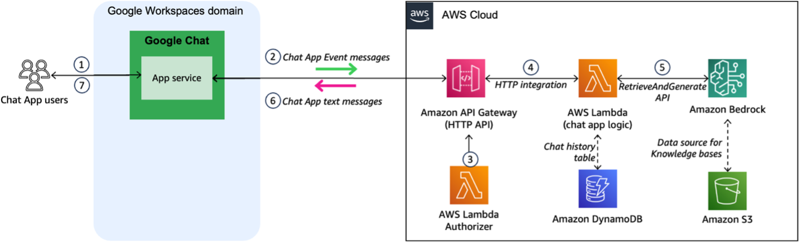

# Deploy an GenAI-based Google Chat App powered by Amazon Bedrock

This solution provides you with an AWS CDK project and resources that are needed to start experimenting integration of Knoweldge bases for Amazon Bedrock with chat Apps available in Google Workspaces.



## Installation

### Pre-requisites

Before proceeding, ensure you have the following set up:

* A development environment with at least 20GB of free disk space. It can be a local machine or a cloud instance. If you use an AWS Cloud9 instance, make sure you have increased the disk size to 20GB.

* A Linux or MacOS terminal on your development environment.

* Docker installed on your development environment.

* [The AWS Command Line Interface (CLI)](https://aws.amazon.com/cli/) installed on your development environment. This tool allows you to interact with AWS services through command-line commands.

* [AWS credentials](https://docs.aws.amazon.com/singlesignon/latest/userguide/howtogetcredentials.html) configured and associated with your AWS account. These credentials authorize the AWS CLI to access resources and services within your AWS account. Typically, you'll set up an AWS Access Key ID and Secret Access Key for a designated IAM user with appropriate permissions.

* An Amazon Bedrock Knowledge base which contains your documents. [Documentation here.](https://docs.aws.amazon.com/bedrock/latest/userguide/knowledge-base-create.html)

* Amazon Bedrock models enabled in your AWS account. You will need [to enable](https://docs.aws.amazon.com/bedrock/latest/userguide/model-access.html) at least the models used in this demo, which can be either Antopic Claude Sonnet 3 or Amazon Titan Text G1 Premier models.

### Installation instructions

Complete the following steps to deploy the CDK project in your AWS account:
1.	Clone the GitHub repository on your local machine.

2.	Install the python package dependencies that are needed to build and deploy the project. This project is set up like a standard Python project.  We recommend that you create a virtualenv within this project, stored under the `.venv` directory. To manually create a virtualenv on MacOS and Linux:

```
$ python3 -m venv .venv
```

After the init process completes and the virtualenv is created, you can use the following
step to activate your virtualenv.

```
$ source .venv/bin/activate
```

3.  Install the python package dependencies that are needed to build and deploy the project. In the root directory, run the following command line :

```
pip install -r requirements.txt
```

4.	Then, run the `cdk bootstrap` command to prepare an AWS environment for deploying the AWS CDK application. 

5.	Run the init script:

```
chmod u+x init-script.bash
./init-script.bash
```

This init script will prompt you: 
    a.	For the ID of the Knowledge Bases for Amazon Bedrock that you will associate with your Google Chat App (see prerequisites section).
    b.	Which large language model (LLM) you want to use on Amazon Bedrock for text generation, through the RetrieveandGenerate Bedrock runtime API. You can choose between either Antopic Claude Sonnet 3 or Amazon Titan Text G1 Premier models.

The script will deploy the AWS CDK project in your account. After it runs successfully, it will output the parameter named “ApiEndpoint”, whose value designates the invoke URL for the HTTP API endpoint deployed as part of this project. Note the value of this parameter as you will need to give it in the Google Chat App configuration.